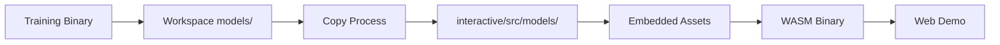

# Architecture Documentation

Comprehensive technical overview of the AI Demo Template architecture, design decisions, and integration strategies.

## Table of Contents

1. [Project Overview & Design Philosophy](#project-overview--design-philosophy)
2. [Workspace Architecture](#workspace-architecture)
3. [Model Persistence & Data Flow](#model-persistence--data-flow)
4. [WASM Integration Strategy](#wasm-integration-strategy)
5. [UI Architecture (Bevy ECS)](#ui-architecture-bevy-ecs)
6. [Theming & Visual Design](#theming--visual-design)
7. [Build System & Development Workflow](#build-system--development-workflow)

---

## Project Overview & Design Philosophy

### Template-First Design

This project is designed as a **reusable template** for creating AI demonstration applications that integrate seamlessly with Rust web applications. The architecture prioritizes:

- **Simplicity**: Minimal complexity for easy understanding and adaptation
- **Modularity**: Clean separation between training, inference, and UI concerns  
- **Cross-Platform**: Works identically on native and WASM targets
- **Integration-Ready**: Designed for embedding in existing web applications

### Core Principles

**1. Separation of Concerns**
- Training logic isolated in dedicated binary
- Interactive demo as separate WASM-compiled binary
- Shared types and utilities in common library

**2. Platform Agnostic**
- Same codebase compiles to native and WASM
- Memory-based model loading works in both environments
- Responsive UI adapts to different deployment contexts

**3. Website Integration**
- Color palette designed for template creator's website (customizable)
- Responsive design for iframe embedding
- Optimized bundle sizes for web deployment

---

## Workspace Architecture

### Three-Crate Structure

```
workspace/
├── training/          # Native binary for model training
├── interactive/       # WASM binary for web demo  
└── shared/           # Common library (model, persistence, types)
```

### Design Rationale

**Separate Binaries Approach**
- **Training**: Heavy ML dependencies, file I/O, long-running processes
- **Interactive**: Lightweight, UI-focused, WASM-optimized
- **Shared**: Common types ensure consistency between training and inference

**Benefits:**
- 🎯 **Optimized Dependencies**: Each binary only includes what it needs
- 🚀 **Faster WASM Builds**: Interactive binary doesn't include training dependencies
- 🔒 **Type Safety**: Shared library ensures model compatibility
- 📦 **Easy Distribution**: Training and demo can be packaged separately

### Dependency Management

**Workspace-Level Dependencies:**
```toml
[workspace.dependencies]
candle-core = "0.9"      # ML framework core
candle-nn = "0.9"        # Neural network components  
anyhow = "1.0.99"        # Error handling
serde = { version = "1.0", features = ["derive"] }
```

**Size Optimization Profile:**
```toml
[profile.release]
opt-level = 'z'          # Optimize for size over performance
strip = "symbols"        # Remove symbol information
lto = true              # Enable link-time optimization  
codegen-units = 1       # Single compilation unit
panic = 'abort'         # Reduce panic handling overhead
```

---

## Model Persistence & Data Flow

### Two-File Architecture

**Design Decision**: Split model storage into metadata and weights
- `demo_model.toml` → Human-readable architecture specification
- `demo_model.safetensors` → Binary weight data (efficient, secure)

**Benefits:**
- ✅ **Human Readable**: TOML metadata can be inspected and modified
- ✅ **Efficient Storage**: SafeTensors format optimized for ML weights
- ✅ **Security**: SafeTensors prevents arbitrary code execution
- ✅ **Validation**: Separate metadata enables architecture verification

### Memory vs File Loading

**Architecture Strategy**: Layered API supporting both approaches

```rust
// WASM-compatible: loads from raw bytes
pub fn load_model_from_data(
    toml_bytes: &[u8], 
    safetensors_bytes: &[u8], 
    device: &Device
) -> Result<DemoMLP>

// Native convenience: reads files then calls load_model_from_data()
pub fn load_model_from_files(base_path: &str, device: &Device) -> Result<DemoMLP>
```

**Why This Approach:**
- 🌐 **WASM Compatibility**: No filesystem operations in core loading logic
- 🔄 **Code Reuse**: Same loading logic for both native and web environments
- 🎯 **Flexibility**: Supports files, embedded assets, or network loading
- 🧪 **Testability**: Easy to test with in-memory data

### Data Flow Architecture



**Training → Interactive Pipeline:**
1. **Training Stage**: Model saved to workspace `models/` directory
2. **Copy Stage**: Files automatically copied to `interactive/src/models/`
3. **Embed Stage**: `embedded_asset!` macro includes files in binary
4. **Runtime Stage**: Model loaded from embedded bytes in WASM

**Why Embedded Assets:**
- 📦 **Self-Contained**: WASM binary includes all required assets
- 🚀 **Fast Loading**: No additional network requests for model files
- 🔒 **Reliability**: Assets can't be missing or corrupted at runtime
- 📱 **Offline**: Demo works without network connectivity

---

## WASM Integration Strategy

### Responsive Canvas Design

**Core Configuration:**
```rust
WindowPlugin {
    primary_window: Some(Window {
        title: "AI Demo - Minimal Scaffolding".into(),
        fit_canvas_to_parent: true,    // Responsive behavior
        resizable: true,               // Allow dynamic sizing
        ..default()
    })
}
```

**Design Benefits:**
- 📱 **Responsive**: Automatically fits parent container
- 🎯 **Flexible**: Works in various iframe sizes
- 🖥️ **Cross-Device**: Adapts to desktop, tablet, mobile
- 🎨 **Integration-Friendly**: Seamlessly embeds in existing layouts

### Build Pipeline Architecture

**Development Configuration (`.cargo/config.toml`):**
```toml
[target.wasm32-unknown-unknown]
runner = "wasm-server-runner"
rustflags = ["--cfg", "getrandom_backend=\"wasm_js\""]
```

**Build Stages:**
1. **Native Compilation**: Standard Rust compilation for development
2. **WASM Compilation**: Rust → WASM using `wasm32-unknown-unknown` target
3. **JS Wrapper Generation**: `wasm-bindgen` creates JavaScript bindings
4. **Web Package**: Complete deployable package in `interactive/web/`

**Production Deployment:**
- Generated files: `interactive.wasm`, `interactive.js`, `index.html`
- Optimized for size with release profile
- Ready for CDN deployment or direct serving

### Browser Compatibility Strategy

**Requirements:**
- Modern browsers with WebAssembly support (95%+ coverage)
- JavaScript enabled (required for WASM loading)
- Canvas support (universal in target browsers)

**Graceful Degradation:**
- Clear error messages for unsupported browsers
- Loading states during WASM initialization
- Fallback UI for network issues

---

## UI Architecture (Bevy ECS)

### State Management

**Application States:**
```rust
#[derive(States, Debug, Clone, PartialEq, Eq, Hash)]
pub enum AppState {
    Loading,    // Model assets being loaded
    Ready,      // Demo ready for user interaction
    Error,      // Error state with diagnostic info
}
```

**State Transition Flow:**
```
Loading → Ready (successful model load)
Loading → Error (model load failure)  
Ready → Error (runtime error)
Error → Loading (retry attempt)
```

### Component Organization

**Marker Components** (Zero-sized, pure markers):
```rust
pub struct TitleText;           // Main title display
pub struct StatusDisplay;       // Model loading status  
pub struct Input1;              // First input field
pub struct Input2;              // Second input field
pub struct PredictButton;       // Prediction trigger button
pub struct OutputDisplay;       // Prediction result
pub struct TrueValueDisplay;    // Expected value
pub struct ErrorDisplay;        // Prediction error
```

**Resource Components** (Shared state):
```rust  
pub struct InputValues {        // Current input field values
    pub input1: String,
    pub input2: String, 
}

pub struct ValidationState {    // Input validation state
    pub input1_valid: bool,
    pub input1_empty: bool,
    pub input2_valid: bool, 
    pub input2_empty: bool,
}
```

### System Organization

**Module Structure:**
- `builders.rs` → UI spawning and construction
- `styles.rs` → Layout and visual styling functions
- `constants.rs` → Centralized configuration values
- `systems.rs` → Runtime behavior and event handling
- `components.rs` → Component definitions

**System Lifecycle:**
1. **Startup**: `setup_ui` spawns initial UI hierarchy
2. **Loading State**: `start_loading_assets`, `check_asset_loading`
3. **Ready State**: Input validation, button interactions, prediction processing
4. **Error State**: Error display and recovery options

### Event-Driven Architecture

**Custom Events:**
```rust
pub struct PredictionRequest {
    pub input1: f32,
    pub input2: f32,
}
```

**Event Flow:**
1. User clicks predict button → Input validation
2. Valid inputs → `PredictionRequest` event sent  
3. Model system processes → Inference computation
4. Result → UI update systems refresh displays

**Benefits:**
- 🔄 **Loose Coupling**: Systems communicate via events, not direct calls
- 🎯 **Testability**: Events can be sent programmatically for testing
- 📊 **Debugging**: Event flow is observable and loggable
- 🚀 **Performance**: Bevy's ECS optimizes system execution order

---

## Theming & Visual Design

### Website Integration Color Palette

**Design Strategy**: Match target website themes for seamless integration

```rust
// Website-matching color palette
pub const BACKGROUND_COLOR: Color = Color::srgb(0.216, 0.255, 0.318); // rgb(55 65 81)
pub const TEXT_COLOR: Color = Color::WHITE;
pub const GREEN_PRIMARY: Color = Color::srgb(0.133, 0.698, 0.298);    // green-500
pub const GRAY_SECONDARY: Color = Color::srgb(0.294, 0.333, 0.388);   // content areas
```

**Color System Benefits:**
- 🎨 **Visual Consistency**: Default colors designed for template creator's website
- 🔧 **Easy Customization**: Single file controls all colors for your branding
- ♿ **Accessibility**: Sufficient contrast ratios maintained
- 📱 **Cross-Platform**: Colors work on all display types

### Responsive Design Principles

**Layout Strategy**:
- Percentage-based widths for flexibility
- Pixel-based heights for consistency
- Flexible gap spacing that scales appropriately
- Centered alignment for various container sizes

**Font Sizing Hierarchy**:
```rust
pub const FONT_SIZE_TITLE: f32 = 28.0;      // Main title
pub const FONT_SIZE_STANDARD: f32 = 16.0;   // Buttons, status, output
pub const FONT_SIZE_LABEL: f32 = 14.0;      // Input labels
pub const FONT_SIZE_HINT: f32 = 12.0;       // Range indicators
```

### Customization Architecture

**Single Source of Truth**: All visual configuration in `constants.rs`

**Customization Categories:**
- **Colors**: Background, text, button, input field states
- **Typography**: Font sizes for different UI element types
- **Layout**: Spacing, padding, margins, component dimensions
- **Behavior**: Input validation ranges, interaction feedback

**Template User Benefits:**
- 🎯 **One-File Changes**: Modify entire appearance from single location
- 📝 **Clear Documentation**: Each constant explains its usage
- 🔍 **Easy Discovery**: Organized by functional categories
- ⚡ **Fast Iteration**: Change values and rebuild to see results

---

## Build System & Development Workflow

### Justfile Command Organization

**Command Categories:**

**Setup & Maintenance:**
```bash
just setup         # Install WASM target and development tools
just clean          # Clean all build artifacts
```

**Build Commands:**
```bash
just build          # Build all workspace components (debug)
just build-release  # Build all workspace components (release)
just build-wasm     # Build WASM binary (debug)
just build-web      # Build complete web package
```

**Development Workflow:**
```bash
just train          # Run training binary
just interactive    # Run interactive demo natively
just wasm           # Run WASM demo with development server
just serve-web      # Serve built web package locally
```

**Code Quality:**
```bash
just fmt            # Format all code
just lint           # Run clippy linting
just test           # Run test suite
just check          # Run all quality checks
```

### Multi-Target Build Process

**Native Build Pipeline:**
1. Standard Rust compilation
2. All system features available
3. File I/O and full std library access
4. Used for development and testing

**WASM Build Pipeline:**
1. Compile to `wasm32-unknown-unknown` target
2. Limited to WASM-compatible features
3. No file I/O, restricted std library
4. Optimized for size and web deployment

**Web Package Generation:**
```bash
# Complete web deployment pipeline
wasm-bindgen --target web \
    --out-dir ./interactive/web/ \
    --out-name "interactive" \
    ./target/wasm32-unknown-unknown/release/interactive.wasm
```

### Development vs Production

**Development Configuration:**
- Debug symbols included
- Faster compilation times
- `wasm-server-runner` for local testing
- Hot-reload capabilities

**Production Configuration:**
- Size optimization (`opt-level = 'z'`)
- Symbol stripping for smaller binaries
- Link-time optimization (LTO)
- Single compilation unit for maximum optimization

**Deployment Artifacts:**
- `interactive.wasm` → Main application binary
- `interactive.js` → JavaScript wrapper and bindings
- `index.html` → Ready-to-serve demo page

---

## Architecture Benefits

### For Template Users

- 🎯 **Clear Separation**: Easy to identify which components to modify
- 📚 **Documented Decisions**: Understand why architecture choices were made
- 🔧 **Flexible Customization**: Well-defined extension points
- 🚀 **Production Ready**: Battle-tested patterns and optimizations

### For Contributors

- 🗺️ **Navigation Guide**: Understand codebase organization quickly
- 🎨 **Design Patterns**: Consistent approaches to common problems
- 🧪 **Testing Strategy**: Architecture supports comprehensive testing
- 📈 **Scalability**: Patterns extend to larger, more complex applications

### For Integration

- 🌐 **Web-First**: Designed specifically for web application embedding
- 📱 **Responsive**: Works across different screen sizes and containers
- 🎨 **Theme-Aware**: Integrates visually with parent applications
- ⚡ **Performance**: Optimized bundle sizes and loading strategies

This architecture provides a solid foundation for creating AI demonstration applications that are maintainable, extensible, and integration-ready.